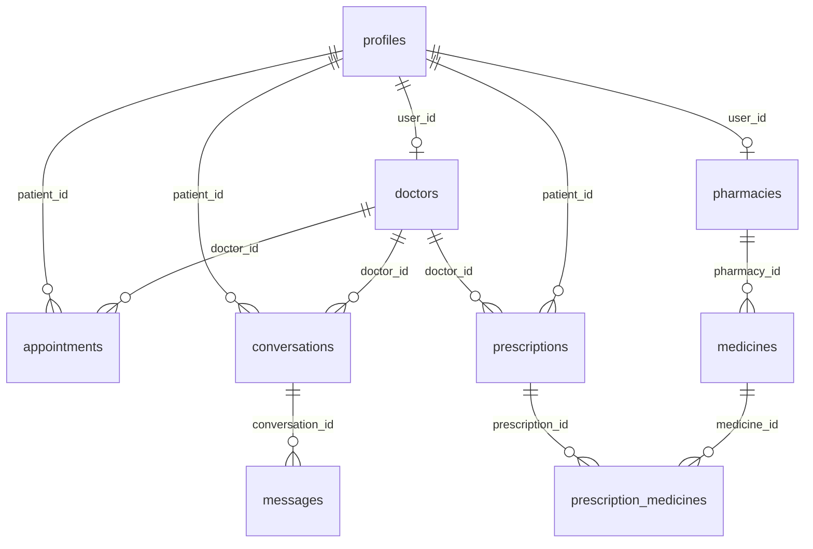

# SaloneCare Database (Phase 2)

PostgreSQL schema for SaloneCare, designed for Supabase.

## Tables

| Table | Purpose |
|-------|---------|
| `profiles` | User profiles linked to `auth.users`; stores role and contact info |
| `doctors` | Doctor credentials, specialization, license/stamp URLs, approval status |
| `pharmacies` | Pharmacy locations, contact info, approval status |
| `appointments` | Patient–doctor bookings with status workflow |
| `conversations` | Doctor–patient chat threads (optionally linked to appointments) |
| `messages` | Individual chat messages (Realtime-enabled) |
| `prescriptions` | Digital prescriptions with QR code, verification status |
| `medicines` | Drug catalog (`pharmacy_id` null) and per-pharmacy inventory |
| `prescription_medicines` | Medicines prescribed with dosage/frequency/instructions |
| `emergency_contacts` | Public emergency numbers and hotlines |

## Enums

- `user_role`: `patient`, `doctor`, `pharmacy`, `admin`
- `approval_status`: `pending`, `approved`, `rejected`
- `appointment_status`: `pending`, `accepted`, `rejected`, `cancelled`, `completed`
- `prescription_status`: `valid`, `invalid`, `expired`, `used`

## Entity Relationships



## Apply Migrations

### Option A: Supabase Dashboard

1. Open your project at [supabase.com/dashboard](https://supabase.com/dashboard)
2. Go to **SQL Editor**
3. Run each file in order:
   - `migrations/00001_initial_schema.sql`
   - `migrations/00002_rls_policies.sql`
   - `migrations/00003_prescription_verification.sql`
4. Optionally run `seed.sql` for default emergency contacts

### Option B: Supabase CLI

```bash
npm install -g supabase
supabase login
supabase link --project-ref YOUR_PROJECT_REF
supabase db push
psql $DATABASE_URL -f supabase/seed.sql
```

## Security

- Row Level Security (RLS) is enabled on all tables
- New auth users automatically get a `profiles` row via `handle_new_user` trigger
- Only **approved** doctors and pharmacies are visible to the public
- Pharmacies verify prescriptions via `verify_prescription_by_code()` — not direct table access
- `messages` and `conversations` are published to Supabase Realtime for Phase 9

## TypeScript Types

Generated manually in [`src/types/database.ts`](../src/types/database.ts). Use with Supabase client:

```typescript
import type { Database } from "@/types/database";
// createClient<Database>(...)
```

## Next Phase

Phase 3 adds authentication UI, role-based route protection, and profile management on top of this schema.
